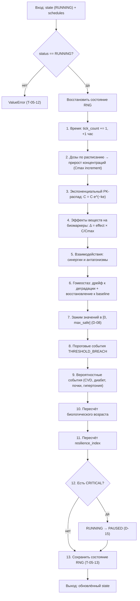
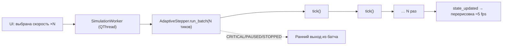
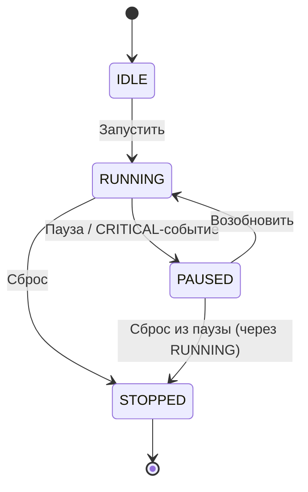

# Движок симуляции (тиковый цикл)

Центральная страница о том, **как работает движок целиком**: как один «тик» (1 час модельного
времени) проходит через все субмодули и как из этого складывается многолетняя траектория
биомаркеров. Реализован в `src/engine/simulation_engine.py` (класс `SimulationEngine`).

> Это страница-«карта»: она связывает воедино [[Pharmacokinetics Model]],
> [[Homeostasis Model]], [[Interaction Resolver]],
> [[Event Detector]], [[Biological Age Formula]],
> [[Adaptive Stepper]] и [[RNG Seeding]].

---

## Ключевые понятия

| Понятие | Значение |
|---------|---------|
| **Тик** | Минимальный шаг времени. **1 тик = 1 астрономический час.** |
| **Batch (батч)** | Пачка тиков, выполняемая за одну итерацию UI-цикла. Размер = множитель скорости (×1..×10000). См. [[Adaptive Stepper]]. |
| **SimulationState** | Изменяемое состояние: значения биомаркеров, концентрации веществ, Cmax, счётчик тиков, состояние RNG, события. |
| **Baseline** | Базовые значения биомаркеров, вычисленные один раз при инициализации по полу/возрасту профиля. |
| **Детерминизм** | При одинаковом `seed` и профиле результат **побитово идентичен** на любой машине. |

---

## Инициализация (`initialize`)

Перед первым тиком движок один раз готовит стартовое состояние:

1. Загружает `substances.json`, `interactions.json`, `reference_ranges.json` (если не переданы явно).
2. Создаёт субмодули: `SimulationRNG`, `PKEngine`, `HomeostasisEngine`, `InteractionResolver`,
   `EventDetector`, `MortalityRiskEngine`.
3. Вычисляет `baseline_biomarkers` — середину оптимального диапазона по полу/возрасту (D-06).
4. Сразу считает стартовые `resilience_index` и `biological_age` по baseline (WR-06), чтобы
   первый тик работал с реальными значениями, а не с заглушками `1.0`/`None`.
5. Переводит FSM в статус `RUNNING` и сохраняет состояние RNG.

---

## Один тик: 13 шагов (`tick`)

Каждый вызов `tick(state, schedules)` выполняет строго упорядоченный конвейер. Внутри тика
**запрещён** файловый ввод-вывод и создание новых Pydantic-объектов (кроме `SimulationEvent`) —
это требование производительности и детерминизма.

### Пошаговое описание

| Шаг | Что делает | Модуль |
|-----|-----------|--------|
| **0** | Проверяет `status == RUNNING` (иначе `ValueError`), восстанавливает `rng_state` для детерминизма при pause/resume | `simulation_engine` / [[RNG Seeding\|RNG]] |
| **1** | Увеличивает `tick_count` и модельное время на 1 час; очищает список событий тика | — |
| **2** | Для каждого расписания проверяет `should_dose()`; при выдаче дозы конвертирует единицы (IU→мг), считает прирост концентрации `ΔC = D·F/(Vd·W)`, обновляет `Cmax` | [[Adaptive Stepper\|Stepper]] + [[Pharmacokinetics Model\|PK]] |
| **3** | Экспоненциально уменьшает концентрацию каждого вещества: `C·e^(−ke)`; удаляет концентрации неизвестных веществ | [[Pharmacokinetics Model\|PK]] |
| **4** | Применяет эффекты веществ на биомаркеры пропорционально `C/Cmax` | [[Pharmacokinetics Model\|PK]] |
| **5** | Усиливает (синергия) или ослабляет (антагонизм) дельты у пересекающихся биомаркеров | [[Interaction Resolver\|Interactions]] |
| **6** | Возрастной дрейф к «деградированным» значениям + восстановление к baseline с учётом resilience и образа жизни | [[Homeostasis Model\|Homeostasis]] |
| **7** | Зажимает все биомаркеры в безопасные границы `[0, max_safe]` | `simulation_engine` (D-08) |
| **8** | Сравнивает значения с зоной `high_risk` → `WARNING`/`CRITICAL` | [[Event Detector\|Events]] |
| **9** | Проверяет вероятностные риски через `rng.random()` | [[Event Detector\|Events]] |
| **10** | Обновляет `biological_age` (частичная PhenoAge) | [[Biological Age Formula\|Bio-Age]] |
| **11** | Обновляет `resilience_index` (albumin, eGFR, HRV) | [[Biological Age Formula\|Bio-Age]] |
| **12** | Если появилось `CRITICAL`-событие — переводит FSM `RUNNING → PAUSED` | `simulation_engine` (D-15) |
| **13** | Сохраняет состояние RNG в `state.rng_state` | [[RNG Seeding\|RNG]] |

> **Порядок важен.** Сначала «внешние» силы (дозы → распад → эффекты → взаимодействия), затем
> «внутренние» (гомеостаз), затем зажим, и только потом — детектирование событий по уже
> финальным значениям тика.

---

## Как тики складываются в батчи

UI не вызывает `tick()` напрямую. Между UI и движком стоит [[Adaptive Stepper]]:

- Множитель скорости = число тиков в одном батче: ×1 → 1, … ×10000 → 10000.
- Движок работает в фоновом потоке `QThread` — интерфейс не зависает даже на ×10000.
- Если внутри батча возник `CRITICAL` (шаг 12 → PAUSED), батч прерывается досрочно.

---

## Автопауза при критических событиях (FSM)

Критическое событие (например, биомаркер ушёл далеко за порог `high_risk` или гипертонический
криз) автоматически ставит симуляцию на паузу и показывает диалог в UI.

---

## Границы ответственности

- `SimulationEngine` **только оркестрирует** — вся предметная логика в субмодулях.
- Внутри `tick()` нет файлового I/O и сети (`biological_age` считается локально, T-05-14).
- Экспорт/восстановление состояния (включая `rng_state`) — отдельный модуль
  `src/engine/exporter.py`, см. [[User Guide]].

---

## Ссылки

- [[Pharmacokinetics Model]] — шаги 2–4 (дозы, распад, эффекты)
- [[Interaction Resolver]] — шаг 5 (синергии/антагонизмы)
- [[Homeostasis Model]] — шаг 6 (дрейф/восстановление)
- [[Event Detector]] — шаги 8–9 (события)
- [[Biological Age Formula]] — шаги 10–11 (возраст/устойчивость)
- [[Adaptive Stepper]] — батчи и скорости
- [[RNG Seeding]] — детерминизм (шаги 0 и 13)
- [[Simulation Assumptions]] — почему модель устроена именно так
