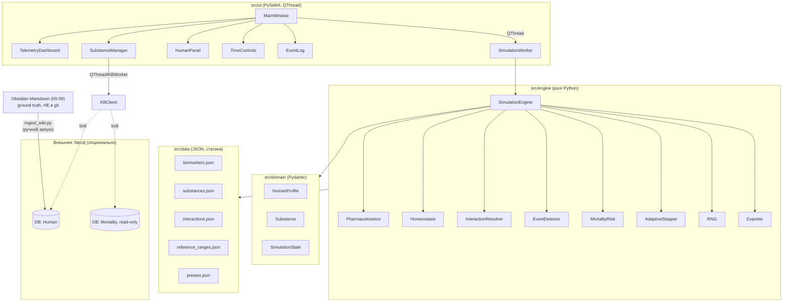

# Application Development Review — im-human (2026-06-28)

> Комплексный технический и продуктовый review приложения im-human на дату 2026-06-28.
> Статусы достоверности: **[Факт]** — подтверждено в коде/конфигурации/документации (указан источник), **[Вывод]** — логически следует из фактов, **[Предположение]** — требует проверки, **[Неизвестно]** — данных недостаточно.

---

## 1. Executive Summary

im-human — десктопное PySide6-приложение для детерминированной симуляции воздействия 7 веществ/интервенций на условную модель биологического возраста и 24 биомаркера человека, с двухслойным хранением знаний (Obsidian Markdown + Neo4j граф/вектор). **[Факт: .planning/PROJECT.md, src/]**

**Состояние:** проект формально завершён как v1.0 (`STATE.md`: 8/8 фаз, 42 плана) **[Факт]**, движок и UI реально реализованы и работают (89 тестов, все проходят при независимом прогоне) **[Факт — проверено агентом]**. Это не MVP-заглушка — рабочий продукт с полным вертикальным срезом: домен → движок → UI → вики → граф знаний.

**Сильные стороны:** чистая доменная модель на Pydantic v2, явная фиксация допущений модели прямо в коде (`[ASSUMED]`-комментарии) и в вики (`Known Limitations.md`), честный медицинский дисклеймер, рабочий UI с graceful degradation при недоступном Neo4j, воспроизводимость по seed подтверждена тестами.

**Главные ограничения:** проект — single-user локальное приложение без релизной инфраструктуры (нет CI/CD, нет инсталлятора, нет подписи кода); расхождения документации и фактического состояния кода (заявлено 75 тестов — фактически 89; заявлено 10 взаимодействий — фактически 6; HOME.md содержит вещество «Ресвератрол», которого нет в коде); вики-markdown не версионируется git (`.gitignore` исключает все папки 00–09); venv проекта непереносим между профилями Windows.

**Критичные риски:** единственная копия ground-truth вики (markdown) не в git и не имеет резервного копирования за пределами файловой системы; единственный сервер Neo4j (<NEO4J_SERVER_IP>) — внешняя точка отказа без описанного fallback; нет UI-доступа к уже реализованному exporter.py (нет кнопок «Сохранить/Загрузить» в интерфейсе).

**Рекомендуемое направление:** Сценарий A (Стабилизация) + выборочные элементы Сценария B — устранить расхождения документации, добавить git-версионирование вики и backup Neo4j, подключить exporter.py к UI, актуализировать README/HOME.md. Полная архитектурная модернизация (Сценарий D) не обоснована — архитектура не блокирует развитие.

---

## 2. Исходные данные и границы анализа

**Изучено:** `src/` (domain, engine, ui, data, tests, scripts), `.neo4j/` (скрипты + живое подключение проверено), `.planning/` (PROJECT.md, ROADMAP.md, STATE.md, RETROSPECTIVE.md, milestones/v1.0-REQUIREMENTS.md), вики-папки 00–09, корневые README.md, HOME.md, CLAUDE.md, log.md, MILESTONES.md, Human_plan_TODO_v1.1.txt, Plan_todo.txt, requirements.txt, git log (~40 последних коммитов), .claude/settings.local.json.

**Не изучено / недоступно:**
- Полная git-история от первого коммита (видна только хвостовая часть лога) — **[Неизвестно]**, влияние на выводы: низкое (даты по ROADMAP.md и log.md покрывают период).
- Содержимое `.neo4j/venv` (переносимость не проверена отдельно от корневого venv) — **[Неизвестно]**, влияние: низкое.
- Реальные пользовательские отзывы — приложение однопользовательское, внешних пользователей не зафиксировано. **[Вывод]**
- UAT с реальным (не mock) Neo4j в работающем приложении — по `STATE.md` явно отмечено как "Pending" **[Факт]**.
- Юридическая оценка дисклеймера и формулировок о рецептурных препаратах — требует юриста, не проверялась. **[Неизвестно]**

**Полнота review:** высокая по коду/архитектуре/тестам (прямой запуск тестов и Neo4j-подключения), средняя по продуктовым/бизнес-аспектам (продукт не коммерческий, многие пункты промта неприменимы).

---

## 3. Паспорт приложения

| Параметр | Значение | Статус |
|---|---|---|
| Рабочее название | im-human | Факт |
| Тип приложения | Десктопное приложение (PySide6) + локальный движок + вики (Obsidian) + удалённая графовая БД (Neo4j) — гибридная архитектура | Факт |
| Назначение | Исследовательская/образовательная симуляция воздействия веществ на биомаркеры и биологический возраст | Факт (README.md, CLAUDE.md) |
| Целевая аудиторию | Не задокументирована явно; по характеру (single-user desktop, технический дисклеймер) — один исследователь/энтузиаст (вероятно сам автор) | Предположение |
| Стадия готовности | v1.0 "SHIPPED" по внутренней документации; по факту — рабочий продукт с полным вертикальным срезом, но без релизной инфраструктуры (инсталлятор, подпись, авто-обновление отсутствуют) | Факт + Вывод |
| Основные функции | Профиль человека (3 пресета), приём веществ с PK-моделированием, гомеостаз, события (threshold/probabilistic), биологический возраст (частичный PhenoAge), дашборд из 24 графиков, журнал событий, экспорт/импорт состояния (API есть, UI нет) | Факт |
| Платформы | Windows (подтверждено путями venv, PowerShell-командами); Linux/macOS не упомянуты и не проверялись | Факт/Предположение |
| Модель использования | Локальный однопользовательский запуск, без сети (кроме опционального Neo4j) | Факт |
| Платная версия | Отсутствует | Факт |
| Серверная часть | Нет собственного сервера приложения; есть внешний Neo4j (<NEO4J_SERVER_IP>) для опциональной базы знаний | Факт |
| Внешние интеграции | Только Neo4j (bolt) + sentence-transformers (локальные эмбеддинги) | Факт |
| Офлайн-режим | Да — движок и UI работают без Neo4j, graceful degradation подтверждена кодом (`kb_client.py` try/except) | Факт |
| Масштаб использования | Один пользователь, один экземпляр | Вывод |

---

## 4. Текущее функциональное состояние

| Функция | Статус | Где реализована | Ограничения | Критичность | Рекомендация |
|---|---|---|---|---|---|
| Доменные модели (HumanProfile, Substance, SimulationState) | Работает | `src/domain/*.py` | Sex.unspecified — усреднённая BMR-константа | Высокая | Сохранить как есть |
| Фармакокинетика (абсорбция/элиминация/Cmax) | Работает | `src/engine/pharmacokinetics.py` | Линейная модель, без EC50/Hill (задокументировано) | Высокая | Не менять без научного основания (см. п.18) |
| Гомеостаз | Работает | `src/engine/homeostasis.py` | Константы дрейфа/восстановления помечены `[ASSUMED]` | Средняя | Зафиксировать источник или провести калибровку |
| Взаимодействия веществ | Работает частично | `src/engine/interaction_resolver.py`, `src/data/interactions.json` | Реализовано 6 взаимодействий из заявленных в вики 10; реальных клинически значимых — порядка 50+ (самооценка в Known Limitations.md) | Средняя | Привести документацию в соответствие коду ИЛИ дополнить взаимодействия |
| Биологический возраст (PhenoAge) | Работает частично | `src/engine/mortality_risk.py` | Частичная формула (4 из 9 биомаркеров PhenoAge), intercept откалиброван вручную под целевой диапазон, явно помечено `[ASSUMED]` | Высокая (это ключевая фича продукта) | Зафиксировать в вики как "приблизительный индекс", не "биологический возраст" в строгом смысле |
| Адаптивный степпер (x1…x10000) | Работает | `src/engine/adaptive_stepper.py` | — | Средняя | — |
| Детектор событий | Работает | `src/engine/event_detector.py` | — | Средняя | — |
| RNG/воспроизводимость | Работает, протестировано | `src/engine/rng.py` | Побитовая идентичность подтверждена тестом | Высокая | — |
| Экспорт/импорт состояния | Работает (backend), не интегрировано в UI | `src/engine/exporter.py`, `test_export_import.py` | Нет кнопок «Сохранить/Загрузить» в `src/ui/main_window.py` — функция недоступна конечному пользователю | Высокая (заявлена в собственном backlog v1.1) | P1 — добавить минимальный UI-доступ |
| UI: главное окно, дашборд, менеджер веществ | Работает | `src/ui/*.py` (327+405+223+238+216+175+150+32 строк) | Сохраняется только геометрия окна (QSettings), не состояние симуляции | Высокая | — |
| Дашборд биомаркеров (24 графика) | Работает | `telemetry_dashboard.py` | — | Средняя | — |
| Neo4j-интеграция (KBClient) | Работает (опционально) | `src/engine/kb_client.py` | graceful degradation подтверждена; единая внешняя точка отказа | Средняя | — |
| Генерация вики-страниц из JSON | Работает (одноразовый скрипт) | `scripts/generate_*_pages.py` (2132 строк, не упомянуты в CLAUDE.md) | Не задокументированы в CLAUDE.md/README как часть архитектуры | Низкая | Добавить в документацию или удалить, если не используются |
| Циркадные ритмы, генетический профиль, нелинейная PD (EC50/Hill) | Не реализовано | — | Заявлено как v2 в собственной вики | Низкая (вне MVP) | Не реализовывать сейчас |
| CI/CD, инсталлятор, авто-обновление | Не реализовано | — | Отсутствует полностью | Средняя (для single-user — низкая) | См. Сценарий A |
| Тесты с живым (не mock) Neo4j | Требует проверки | — | `STATE.md` отмечает как Pending UAT | Низкая | Выполнить вручную перед следующим релизом |

---

## 5. Текущая архитектура

**Модель:** модульный монолит на одной машине: UI-слой (PySide6) ↔ движок симуляции (чистый Python, без I/O в тиковых методах) ↔ доменные модели (Pydantic) ↔ JSON-конфигурация (статические данные) + опциональный внешний Neo4j (граф знаний, синхронизируется вручную из markdown-вики). **[Факт + Вывод]**

Границы компонентов чёткие: `domain/` не зависит от `engine/`, `engine/` не делает файлового/сетевого I/O в горячем пути (явно задокументированный архитектурный запрет, подтверждён в нескольких модулях комментариями). UI взаимодействует с движком через `QThread` + worker-объект (`worker.py`), что корректно разделяет расчёт и event loop — это предотвращает блокировку интерфейса при долгих симуляциях (x10000).

**Архитектурные проблемы:**
1. Вики (ground truth по правилу DUAL-LAYER в CLAUDE.md) исключена из git `.gitignore` строки 6–16 — единственная копия — локальная файловая система. **[Факт]** Риск потери данных при сбое диска/синка.
2. Синхронизация Markdown → Neo4j не автоматическая, ручная команда `ingest_wiki.py --changed-only` — расхождение между слоями возможно и не отслеживается автоматически (нет git-хука, нет CI). **[Вывод]**
3. Единственный Neo4j-сервер на внешнем IP без описанной отказоустойчивости/backup-процедуры. **[Факт + Вывод]**
4. `exporter.py` реализован, но не подключён к UI — разрыв между backend-возможностью и пользовательской ценностью. **[Факт]**

**Целевое состояние и путь миграции** — см. разделы 20–21.

---

## 6. Технологический стек

| Компонент | Версия (requirements.txt) | Фактически установлено | Оценка |
|---|---|---|---|
| Python | 3.11+ (заявлено) | 3.14.5/3.14.6 (фактически в venv) | Актуально, поддерживается |
| Pydantic | >=2.0 | 2.13.4 | Актуально |
| PySide6 | >=6.6 | — | Актуально, активно поддерживается Qt |
| pyqtgraph | >=0.13.0 | 0.14.0 | Актуально |
| neo4j (driver) | >=5.0 | 6.2.0 (по log.md) | Актуально |
| sentence-transformers | >=2.2 | — | Используется только для эмбеддингов вики, не в горячем пути приложения |
| pytest / pytest-cov | >=7.0 / >=4.0 | — | Стандартно |
| python-dotenv | >=1.0 | — | Стандартно |

**Риски:** все зависимости заданы только нижней границей (`>=`) без верхнего пина — при переустановке окружения через год возможны breaking changes (особенно Pydantic v2.x минорные релизы меняют поведение валидации, PySide6 мейджоры). **Рекомендация:** зафиксировать диапазон верхней границы (`<3.0` и т.п.) или lock-файл (`pip freeze` / `uv.lock`). Не требует немедленного действия — приложение не в продакшен-эксплуатации с автообновлением зависимостей.

Обновление версий ради версий не рекомендуется — нет известных уязвимостей или прекращения поддержки текущих версий.

---

## 7. Сильные стороны (сохранить)

- Чистое разделение `domain/engine/ui/data` без циклических зависимостей. **[Факт]**
- Явный архитектурный запрет I/O в тиковом цикле движка, задокументированный прямо в коде. **[Факт]**
- Воспроизводимость по seed подтверждена тестом на побитовое равенство (не `isclose`). **[Факт]**
- Допущения модели маркированы `[ASSUMED]` непосредственно в коде рядом с константами (`mortality_risk.py`, `homeostasis.py`) — редкая дисциплина, упрощает будущий аудит. **[Факт]**
- Честная самооценка ограничений в вики (`Known Limitations.md`) — отделяет продукт от псевдонаучных claim'ов. **[Факт]**
- Graceful degradation при недоступности Neo4j на всех уровнях (engine optional, UI try/except). **[Факт]**
- QThread-паттерн в UI корректно реализован (worker object, сигналы/слоты, teardown в `closeEvent`). **[Факт]**
- 89 тестов покрывают PK, гомеостаз, взаимодействия, события, воспроизводимость, экспорт/импорт, UI offscreen smoke, KB mock-клиент — широкий охват для объёма кода (~8700 LOC). **[Факт]**

---

## 8. Ограничения

**Технические:** линейная PK/PD-модель без EC50/Hill, без циркадных ритмов, без генетических вариаций — все задокументированы самим проектом как сознательные упрощения MVP.

**Архитектурные:** вики не версионируется git; ручная (не автоматическая) синхронизация Markdown→Neo4j; единственная точка отказа — внешний Neo4j-сервер; venv непереносим между профилями Windows (`pyvenv.cfg` ссылается на путь конкретного пользователя `elianora`).

**Продуктовые:** exporter.py не интегрирован в UI; вещество "Ресвератрол" заявлено в HOME.md, но не реализовано в коде (опечатка/устаревшая запись — фактическое вещество называется Berberine); заявлено 10 взаимодействий вместо фактических 6.

**Организационные:** нет CI/CD, нет процесса релиза/версионирования сборок, `log.md` (append-only журнал) практически не велся (2 записи за 5 дней активной разработки при 174 коммитах) — журнал не выполняет заявленную функцию.

**Финансовые:** отсутствуют — нет коммерческой модели, нет облачных расходов кроме Neo4j-хостинга (стоимость которого не задокументирована — **[Неизвестно]**).

**Инфраструктурные:** Windows-only по факту использованных путей/команд; не проверена работа на Linux/macOS.

**Юридические:** дисклеймер о рецептурных препаратах (метформин, рапамицин) присутствует и показывается при каждом запуске — хорошая практика, но формулировки не проверялись юристом. **[Предположение о достаточности]**

---

## 9. Проблемы и технический долг

| ID | Проблема | Компонент | Последствие | Вероятность | Критичность | Сложность исправления | Рекомендация |
|---|---|---|---|---|---|---|---|
| TD-01 | Вики-markdown не в git (.gitignore исключает 00–09, Assets) | Хранение данных | Потеря единственной копии ground truth при сбое диска | Низкая | P0 | Низкая (снять исключение, закоммитить) | Включить вики в git немедленно |
| TD-02 | README/PROJECT.md заявляют 75 тестов, фактически 89 | Документация | Дезинформация при онбординге/аудите | Высокая (уже произошло) | P2 | Низкая | Обновить цифры в README.md, PROJECT.md, RETROSPECTIVE.md |
| TD-03 | Known Limitations.md заявляет 10 взаимодействий, фактически 6 в interactions.json | Документация/данные | Несоответствие продукта описанию | Высокая | P2 | Низкая (исправить текст) либо Средняя (добавить 4 взаимодействия) | Исправить текст немедленно; добавление взаимодействий — отдельная задача P3 |
| TD-04 | HOME.md содержит "Ресвератрол" вместо фактического Berberine, ссылка на несуществующую страницу `03 - Substances/Resveratrol` | Документация/вики | Битая ссылка, путаница пользователя | Высокая | P2 | Низкая | Исправить таблицу в HOME.md |
| TD-05 | exporter.py не подключён к UI | UI/Engine | Реализованная функциональность недоступна пользователю | Высокая | P1 | Средняя | Добавить кнопки Save/Load в main_window.py (уже в собственном backlog v1.1) |
| TD-06 | venv создан под профилем `elianora`, не работает под `Administrator` | Окружение | Невозможность запустить проект без переустановки venv на новой машине/профиле | Высокая (уже проявилось) | P1 | Низкая | Пересоздать venv, добавить инструкцию "venv непереносим, создавайте локально" |
| TD-07 | Артефакты `=0.13.0` и `=2.0` в корне репозитория (случайный вывод pip) | Гигиена репозитория | Шум в репозитории, потенциальное попадание в git | Низкая | P3 | Тривиальная | Удалить файлы |
| TD-08 | `db_stats.py` содержит invalid escape sequence (`SyntaxWarning: "\O"`) | .neo4j/ | Шум в выводе, потенциальный баг при изменении Python | Низкая | P3 | Тривиальная | Исправить regex/строку |
| TD-09 | log.md почти не велся (2 записи за весь проект) | Процесс | Потеря истории решений для будущего аудита | Средняя | P2 | Низкая (процессная) | Дисциплинировать обновление по правилу CLAUDE.md |
| TD-10 | `mortality_risk.py`: PHENOAGE_INTERCEPT_PARTIAL ручную подогнан под целевой диапазон теста, а не рассчитан научно | Engine | Биологический возраст — ключевая фича — может давать систематически смещённые значения | Средняя | P1 | Высокая (требует научной калибровки) | Явно лейблить в UI как "ориентировочный индекс", запланировать пересчёт |
| TD-11 | Зависимости без верхнего пина версий | requirements.txt | Возможные breaking changes при переустановке через продолжительное время | Низкая (риск отложенный) | P3 | Низкая | Добавить верхние границы или lock-файл |
| TD-12 | scripts/generate_*_pages.py (2132 строк) не описаны в CLAUDE.md/README | Документация | Непонятно новому разработчику, для чего эти файлы | Низкая | P3 | Низкая | Добавить раздел в README или удалить если разово использованы |

---

## 10. Безопасность

| Аспект | Состояние | Оценка |
|---|---|---|
| Аутентификация/авторизация | Отсутствует (локальное single-user приложение, не нужна) | Не применимо |
| Хранение секретов Neo4j | `.neo4j/.env` с реальными кредами, исключён из git через `.gitignore` | Факт — корректная практика |
| SQL/Cypher-инъекции | `kb_client.py` использует параметризованные Cypher-запросы (T-07-01) | Факт — защищено |
| Загрузка файлов / десериализация | exporter.py — JSON-сериализация состояния, формат не проверялся на произвольный код (`pickle` не используется — JSON безопасен по умолчанию) | Вывод — низкий риск |
| Сетевые порты | Только исходящее bolt-соединение к Neo4j, приложение не открывает входящих портов | Факт |
| Зависимости с уязвимостями | Не проверялось (нет `pip-audit`/`safety` в процессе) | Неизвестно — рекомендуется разовая проверка, P2 |
| Локальное хранение данных | Профили/JSON-конфиги — открытый доступ файловой системы, не содержат персональных медицинских данных реального человека (это симулированные профили) | Вывод — низкий риск, нет PII |
| Подпись дистрибутива / автообновление | Отсутствует — приложение не дистрибутируется за пределы машины разработчика | Не применимо на данной стадии |

Для локального приложения отдельно: права на каталоги не настраивались специально (стандартные права пользователя Windows), множественные экземпляры приложения не обрабатываются явно (QSettings может конфликтовать при параллельном запуске) — низкий риск при single-user использовании.

Эксплуатация уязвимостей не описывается (согласно правилам review) — отмечены только риски и меры защиты.

---

## 11. Данные и база данных

**Хранилища:** JSON-файлы (статическая справочная конфигурация: биомаркеры, вещества, взаимодействия, референсы, пресеты) + Neo4j (граф знаний и векторный поиск, опционально) + в памяти `SimulationState` во время работы (персистентность только через exporter.py, не подключённый к UI).

**Целостность:** Pydantic-валидация на доменном уровне; ValueError на некорректные переходы состояний/параметры PK (half_life ≤ 0, Vd ≤ 0); защита от NaN через `math.isfinite`.

**Миграции/версии схемы:** для JSON-данных не предусмотрены формальные миграции (`_version` поле в biomarkers.json есть, но механизм миграции версий не описан) — **[Факт + Вывод]**, риск низкий при текущем масштабе (статичные данные, редко меняются).

**Резервное копирование:** для вики (markdown) — отсутствует за пределами файловой системы пользователя (см. TD-01); для Neo4j — не описано в `.neo4j/README.md`, не проверялось — **[Неизвестно]**, это P0/P1 риск, т.к. единственный сервер.

**Рост объёма данных:** Neo4j — 671 узел в Human DB, 432 чанка вики — рост линейный и медленный (привязан к объёму markdown-страниц, пишет вручную автор). Не требует мер по масштабированию на годы вперёд при текущей скорости роста.

**Персональные данные:** отсутствуют — все профили синтетические (пресеты), не привязаны к реальным людям. Юридические требования по PII не применимы. **[Вывод]**

**Для AI/аналитической части:** sentence-transformers модель (`paraphrase-multilingual-MiniLM-L12-v2`) — локальная, без внешнего API, воспроизводимость эмбеддингов не тестировалась explicitly, но детерминированность модели стандартна для этого класса моделей. Inference — локальный, без затрат на внешний API.

---

## 12. Производительность и масштабирование

- Benchmark подтверждён тестом: 8760 тиков (1 симулированный год) выполняются менее 5 секунд (`test_benchmark.py`). **[Факт]**
- Тиковый движок без I/O — узких мест по диску/сети в горячем пути нет по архитектуре.
- Текущая нагрузка — один пользователь, один процесс, без параллельных симуляций — масштабирование не требуется на данном этапе. **[Вывод]**
- Точка потенциального насыщения: UI-дашборд держит `deque(maxlen=5000)` на каждый из 24 биомаркеров — это ограничивает память предсказуемо, не вызывает проблем при длительных прогонах.
- Сетевой трафик — только запросы к Neo4j по требованию пользователя (поиск в KB), не в горячем пути симуляции.

Масштабирование за пределы single-user не обосновано текущими данными — рекомендаций по горизонтальному масштабированию не даётся (соответствует правилу "не масштабировать без подтверждённой потребности").

---

## 13. UX и пользовательские сценарии

**Реализовано:** главное окно с 5 docked-панелями (профиль, управление временем, дашборд из 24 графиков, журнал событий, менеджер веществ), сохранение геометрии окна между сессиями, предупреждение (`QMessageBox.warning`) при критичных событиях, дисклеймер при каждом запуске.

**Проблемы:**
- Нет UI-доступа к сохранению/загрузке состояния симуляции, хотя backend готов (TD-05) — пользователь не может прервать и продолжить долгий сценарий между запусками приложения. Критичность высокая для основного пользовательского сценария.
- Onboarding не описан отдельно от `06 - Engine/User Guide.md` — стоит проверить, насколько вики-инструкция доступна из самого приложения (нет данных о наличии меню "Справка" в UI — **[Неизвестно]**, рекомендуется проверить `main_window.py` на наличие Help-меню).
- Локализация — не проверялась (приложение и вики на русском, UI-тексты — **[Неизвестно]**, нужна проверка строк в `src/ui/*.py`).

**Быстрые улучшения (P1–P2):** добавить Save/Load в UI; добавить пункт меню со ссылкой/текстом на `User Guide` и дисклеймер ограничений.

---

## 14. Тестирование и качество

**Текущее состояние:** 89 тестов в 12 файлах (1906 строк), независимо запущены и пройдены (89 passed, 12.89 сек, offscreen Qt). Покрытие: PK, гомеостаз, взаимодействия, события, воспроизводимость (seed), пауза/возобновление RNG, benchmark производительности, экспорт/импорт round-trip, UI offscreen smoke-тесты, KB client с mock Neo4j driver.

**Не покрыто:** интеграционный тест с живым (не mock) Neo4j в контексте работающего приложения — явно отмечено как Pending UAT в `STATE.md`.

**Рекомендуемый минимальный набор перед следующим релизом:** unit (есть) + integration с mock (есть) + один ручной end-to-end прогон с реальным Neo4j-подключением перед каждым релизом, т.к. автоматизировать это безопасно сложнее (внешний сервер, креды).

Пирамида тестирования для масштаба проекта (single-user desktop) уже близка к оптимальной — не требует дополнительных уровней (нагрузочное/security-тестирование избыточны на этой стадии).

---

## 15. Эксплуатация и сопровождение

Развёртывание — `git clone` + `venv` + `pip install` + `python src/main.py`, без инсталлятора/контейнеризации/CI. Это адекватно для single-user проекта на стадии "рабочий продукт для себя", но создаёт риск при передаче другому человеку/машине (TD-06 — непереносимый venv).

Мониторинг/health-check/crash-report — отсутствуют, не требуются для текущего масштаба использования (один пользователь, нет удалённой эксплуатации).

Минимальный набор наблюдаемости, рекомендуемый при сохранении текущего масштаба:
- Логировать: ошибки подключения к Neo4j, исключения движка симуляции (если не покрыты UI-сообщением).
- Не логировать: содержимое `.neo4j/.env` (уже не логируется).
- Критичные ошибки: невозможность загрузки `src/data/*.json` при старте — должно явно блокировать запуск с понятным сообщением (не проверено, **[Неизвестно]**, рекомендуется ручная проверка).

---

## 16. Документация

| Документ | Статус | Действие |
|---|---|---|
| README.md | Устарел в деталях (число тестов) | Обновить (TD-02) |
| HOME.md | Содержит ошибку (Ресвератрол vs Berberine), битую ссылку | Обновить (TD-04) |
| Known Limitations.md | Устарел в деталях (число взаимодействий) | Обновить (TD-03) |
| CLAUDE.md | Актуален, описывает реальную структуру (UI и тесты, заявленные в нём, подтверждены фактически существующими) | Сохранить |
| .neo4j/README.md | Не проверено на устаревание детально | Сверить при следующем изменении схемы |
| log.md | Технически актуален, но почти не велся (TD-09) | Возобновить ведение по правилу append-only |
| User Guide (06 - Engine) | Существует, не оценивалась глубоко на актуальность | Сверить с UI после добавления Save/Load |
| Документация по релизу/разворачиванию для нового пользователя/машины | Отсутствует упоминание о непереносимости venv | Добавить примечание в README |

---

## 17. Продуктовые возможности (развитие)

**Обязательные (для устранения текущих несоответствий):**
- UI-доступ к exporter.py (Save/Load).
- Исправление документационных расхождений (TD-02, TD-03, TD-04).
- Git-версионирование вики и backup Neo4j.

**Полезные:**
- Помечать индекс биологического возраста в UI как "ориентировочный" с явной ссылкой на Known Limitations.
- Пункт меню "Справка"/дисклеймер/User Guide прямо из приложения, если отсутствует.
- Верхние границы версий зависимостей или lock-файл.

**Экспериментальные (только при наличии ресурсов, см. v2 backlog продукта):** субсуточные тики + циркадные ритмы, генетический профиль, нелинейная PD (EC50/Hill), A/B сравнение сценариев, CGM/HL7 FHIR импорт.

**Не рекомендуется на текущем этапе:** Streamlit web-версия и Telegram-бот (из собственного v2.0 backlog) — для single-user локального инструмента без внешних пользователей это распределённая инфраструктура без подтверждённой потребности; противоречит правилу "не масштабировать без необходимости". Также не рекомендуется полное архитектурное переписывание (см. Сценарий D) — нет оснований.

---

## 18. Сценарии развития

### Сценарий A. Стабилизация

| Параметр | Описание |
|---|---|
| Цель | Закрыть расхождения документации/кода, защитить единственную копию данных (git+backup), сохранить текущую функциональность |
| Основные изменения | Git-версионирование вики; backup Neo4j; обновить README/HOME/Known Limitations; пересоздать переносимый venv; удалить артефакты (`=0.13.0`, `=2.0`); исправить escape-warning в db_stats.py |
| Ожидаемый результат | Данные защищены, документация соответствует коду, проект воспроизводим на новой машине |
| Срок | 1–2 недели (один разработчик, неполная занятость) |
| Требуемая команда | 1 человек (текущий автор) |
| Сложность | Низкая |
| Стоимость относительно других | Минимальная |
| Главные риски | Низкие — почти все правки точечные |
| Что сохраняется | Вся текущая архитектура и функциональность |
| Что заменяется | Только процессные/документационные артефакты |
| Критерии успеха | Вики в git; задокументирован backup Neo4j; README/HOME без расхождений с кодом; venv создаётся и работает на чистой машине |
| Условия выбора | По умолчанию — всегда выполняется первой, независимо от выбора следующего сценария |

### Сценарий B. Постепенное развитие

| Параметр | Описание |
|---|---|
| Цель | Закрыть разрыв backend/UI (Save/Load), улучшить UX, не меняя архитектуру |
| Основные изменения | Кнопки Save/Load в main_window.py (используют готовый exporter.py); пункт меню справки; явная пометка приблизительности biologicalAge в UI; верхние границы версий зависимостей |
| Ожидаемый результат | Пользователь может прерывать/продолжать сценарии; меньше риска недопонимания точности модели |
| Срок | 2–4 недели после Сценария A |
| Требуемая команда | 1 человек |
| Сложность | Низкая-средняя |
| Стоимость | Низкая |
| Главные риски | Минимальные — UI-надстройка над существующим backend |
| Что сохраняется | Вся архитектура, движок, данные |
| Что заменяется | Только UI-слой (добавление, не переписывание) |
| Критерии успеха | Save/Load доступны из меню/панели; round-trip тест проходит и через UI вручную |
| Условия выбора | Рекомендуется сразу после Сценария A — низкая стоимость, высокая отдача (это уже в собственном backlog проекта как v1.1) |

### Сценарий C. Масштабирование продукта

| Параметр | Описание |
|---|---|
| Цель | Подготовить к множественным пользователям/конкурентному использованию (например, Streamlit web-версия, multi-tenant) |
| Основные изменения | Выделение движка симуляции в отдельный сервис, REST/gRPC API, многопользовательская Neo4j-схема (роли/tenant), хостинг, тарификация при необходимости монетизации |
| Ожидаемый результат | Продукт доступен нескольким пользователям одновременно |
| Срок | Месяцы, не недели |
| Требуемая команда | 2+ человек (backend + frontend/devops) |
| Сложность | Высокая |
| Стоимость | Высокая относительно A/B |
| Главные риски | Нет подтверждённого спроса на многопользовательский режим — основной риск это вложение ресурсов без потребности |
| Что сохраняется | Доменная модель и движок (переносимы в сервис без переписывания бизнес-логики) |
| Что заменяется | UI-слой (десктоп → web), модель хранения состояния (in-memory → per-user persistence) |
| Критерии успеха | Не определены — отсутствует подтверждённая бизнес-потребность |
| Условия выбора | Только при появлении подтверждённого спроса нескольких пользователей; **не рекомендуется сейчас** |

### Сценарий D. Архитектурная модернизация

| Параметр | Описание |
|---|---|
| Цель | Существенная переработка архитектуры или стека |
| Основания (проверка) | Архитектура блокирует развитие? — Нет, подтверждённых блокеров не найдено. Стек не поддерживается? — Нет, все компоненты актуальны. Стоимость изменений растёт? — Нет признаков. Безопасность невозможна? — Нет. Масштабирование невозможно? — Не требуется при текущем масштабе. Код не тестируется? — Нет, 89 тестов проходят. Поддержка экономически неэффективна? — Нет данных об этом. |
| Вывод | **Ни одно из условий применимости Сценария D не подтверждено.** Полная модернизация/переписывание не обоснованы. |
| Условия выбора | Пересмотреть только если появится требование многопользовательского облачного режима с строгими SLA — тогда это будет частный случай Сценария C, не D |

---

## 19. Рекомендуемый сценарий

**Рекомендация: Сценарий A → затем Сценарий B.**

Обоснование: текущие проблемы — это гигиена данных/документации и один UX-разрыв (Save/Load), а не архитектурные дефекты. Продукт уже представляет собой рабочий вертикальный срез с покрытием тестами. Инвестировать в Сценарий C или D сейчас означало бы решать проблему, которой не существует (нет подтверждённого многопользовательского спроса), при наличии реальных, дешёвых в исправлении рисков (TD-01 — незащищённые данные; TD-05 — недостающий UI к готовому backend).

**Отклонённые альтернативы:** Сценарий C — отклонён за отсутствием подтверждённого спроса. Сценарий D — отклонён за отсутствием технических оснований (раздел 18).

**Что может изменить выбор:** появление второго реального пользователя продукта или решение монетизировать — тогда стоит пересмотреть Сценарий C, но только после того, как Сценарии A и B выполнены (иначе риски данных и недоинтегрированный UI унаследуются в более сложную систему).

---

## 20. Целевая архитектура (6–18 месяцев)

Без радикальных изменений: тот же модульный монолит (`domain/engine/ui`), но с устранёнными разрывами:

- Вики — версионируется в git (полная история изменений markdown), синхронизация с Neo4j остаётся ручной/полу-автоматической (допустимо для single-user, не требует CI/CD-автоматизации).
- Neo4j — добавлена задокументированная процедура backup (даже простой периодический dump).
- UI — Save/Load встроены; возможно добавление экспорта графиков в PNG/SVG (из собственного v2 backlog, низкая сложность, высокая отдача).
- При появлении генетического профиля/циркадных ритмов (v2 фичи) — расширение `HumanProfile` и `effectProfile`, без изменения границ компонентов (domain/engine остаются изолированными).

Не предлагается переход к микросервисам, веб-хостингу или multi-tenant архитектуре без подтверждённой потребности (раздел 18, Сценарий C).

---

## 21. План перехода

**Этап 0. Уточнение и измерение**
- Подтвердить у владельца продукта: ожидается ли передача другому пользователю/машине (влияет на приоритет TD-06, TD-01).
- Проверить наличие backup-процедуры на стороне хостинга Neo4j <NEO4J_SERVER_IP> (у провайдера сервера) — **[Открытый вопрос]**.

**Этап 1. Стабилизация**
- Включить вики в git (снять исключения в `.gitignore` для 00–09/Assets, закоммитить).
- Настроить минимальный backup Neo4j (периодический `db_stats.py`/dump или экспорт через `ingest_wiki.py --dry-run` логику — нужно отдельное решение для backup, не входящее в текущие скрипты).
- Исправить README.md (число тестов), Known Limitations.md (число взаимодействий), HOME.md (Ресвератрол → Berberine, битая ссылка).
- Пересоздать venv без зависимости от конкретного профиля Windows; зафиксировать в README "venv не переносится между машинами, создавайте локально".
- Удалить артефакты `=0.13.0`, `=2.0`; исправить escape-warning в `db_stats.py`.

**Этап 2. Подготовка основы**
- Добавить верхние границы версий в requirements.txt или lock-файл.
- Возобновить ведение log.md по факту значимых изменений.
- Добавить (опционально) `pip-audit`/`safety`-проверку как разовую/периодическую ручную процедуру.

**Этап 3. Функциональное развитие**
- Подключить exporter.py к UI (кнопки Save/Load).
- Добавить пункт меню "Справка"/ссылку на User Guide и дисклеймер ограничений из самого приложения, если отсутствует.
- Явно пометить biologicalAge в UI как приблизительный индекс с ссылкой на Known Limitations.

**Этап 4. Масштабирование** — не выполняется без подтверждённой потребности (см. раздел 18).

**Этап 5. Оптимизация** — экспорт графиков PNG/SVG, прочие v2-фичи по запросу владельца продукта, после этапов 1–3.

---

## 22. Roadmap

- **2–4 недели:** Этап 0 + Этап 1 (защита данных, исправление документации, переносимость venv).
- **1–3 месяца:** Этап 2 + Этап 3 (lock-файл, Save/Load в UI, пометка приблизительности biologicalAge).
- **3–6 месяцев:** опциональные v2-фичи низкой сложности (экспорт графиков), пересмотр научной калибровки `mortality_risk.py`, если у владельца появится время/мотивация.
- **6–12 месяцев:** при наличии подтверждённого спроса — пересмотр Сценария C; иначе — поддержка текущего состояния.
- **Более 12 месяцев:** не прогнозируется — недостаточно данных о долгосрочных планах владельца продукта.

Сроки приведены как диапазоны при допущении, что разработка ведётся одним человеком в свободное от других задач время (по аналогии с фактическим темпом v1.0 — 174 коммита за 5 дней интенсивной работы говорит о высокой личной продуктивности при выделенном времени, но это не означает аналогичный темп для последующих этапов).

---

## 23. Backlog верхнего уровня

| ID | Инициатива | Тип | Приоритет | Польза | Сложность | Зависимости | Критерий готовности |
|---|---|---|---|---|---|---|---|
| BL-01 | Включить вики-markdown в git | Стабилизация | P0 | Высокая | Низкая | — | `git log` показывает историю файлов 00–09 |
| BL-02 | Backup-процедура Neo4j | Стабилизация | P0 | Высокая | Низкая-средняя | Доступ к хостингу | Документированный и проверенный restore |
| BL-03 | Исправить README/HOME/Known Limitations (числа, ссылки) | Документация | P2 | Средняя | Низкая | — | Цифры совпадают с кодом, ссылка на Berberine не битая |
| BL-04 | Пересоздать переносимый venv + примечание в README | Стабилизация | P1 | Высокая | Низкая | — | venv работает на чистом профиле Windows |
| BL-05 | Удалить артефакты `=0.13.0`/`=2.0`, исправить escape-warning | Гигиена | P3 | Низкая | Тривиальная | — | Файлы удалены, warning не воспроизводится |
| BL-06 | Save/Load в UI (обвязка над exporter.py) | Функция | P1 | Высокая | Средняя | exporter.py (готов) | Пользователь сохраняет/загружает состояние из главного окна |
| BL-07 | Пометка biologicalAge как приблизительного индекса в UI | UX/доверие | P1 | Средняя | Низкая | — | В UI и tooltip есть ссылка на Known Limitations |
| BL-08 | Lock-файл / верхние границы версий зависимостей | Стабилизация | P3 | Низкая | Низкая | — | requirements.txt/lock воспроизводит текущее окружение через год |
| BL-09 | Разовая проверка зависимостей на уязвимости | Безопасность | P2 | Средняя | Низкая | — | Отчёт pip-audit/safety без критичных находок |
| BL-10 | Документировать scripts/generate_*_pages.py | Документация | P3 | Низкая | Низкая | — | README описывает назначение или файлы удалены |

---

## 24. Реестр рисков

| Риск | Категория | Вероятность | Влияние | Индикатор | Меры снижения |
|---|---|---|---|---|---|
| Потеря вики-markdown (единственная копия вне git) | Данные | Низкая | Высокое | Сбой диска/случайное удаление | BL-01 |
| Недоступность/потеря Neo4j-сервера без backup | Данные/инфраструктура | Низкая | Среднее (только граф знаний, не критичен для движка) | Сбой хостинга <NEO4J_SERVER_IP> | BL-02 |
| Невозможность развернуть проект на новой машине | Эксплуатация | Высокая (уже проявлялось) | Среднее | Ошибка запуска venv/Scripts/python.exe | BL-04 |
| Расхождение документации и кода вводит в заблуждение | Продукт/доверие | Высокая (уже произошло) | Низкое-среднее | Несовпадение README/HOME с кодом | BL-03 |
| Пользователь принимает biologicalAge за точный медицинский показатель | Продукт/этика | Средняя | Среднее | Отсутствие явной пометки в UI | BL-07 |
| Breaking change в зависимости при переустановке через продолжительное время | Технический | Низкая | Низкое | requirements.txt без верхних границ | BL-08 |
| Уязвимость в зависимости (неизвестна, не проверялась) | Безопасность | Неизвестно | Неизвестно | Отсутствие pip-audit | BL-09 |

---

## 25. Метрики успеха

Релевантные для single-user исследовательского проекта:

- **Стабильность:** доля прохождения тест-сьюта (целевое 100%, сейчас 89/89).
- **Покрытие тестами:** число тестов не падает при добавлении функций (сейчас 89, отслеживать).
- **Соответствие документации коду:** 0 расхождений чисел/ссылок между README/HOME/Known Limitations и фактическим кодом/данными (сейчас минимум 3 расхождения — TD-02, TD-03, TD-04).
- **Время восстановления данных:** наличие и время выполнения проверенного restore вики/Neo4j (сейчас неопределено — нет процедуры).
- **Воспроизводимость окружения:** успешная установка `venv` + запуск тестов на чистой машине/профиле без ручных правок (сейчас — нет, см. TD-06).
- **Полнота функций для пользователя:** доля backend-возможностей, доступных через UI (Save/Load — пример пробела).

Метрики вроде "конверсия", "удержание", "активные пользователи", "стоимость инфраструктуры" неприменимы — нет внешних пользователей и коммерческой модели.

---

## 26. Открытые вопросы

**К владельцу продукта:**
- Планируется ли передача приложения другим пользователям или это остаётся личным инструментом?
- Есть ли мотивация довести научную калибровку biologicalAge (PHENOAGE_INTERCEPT_PARTIAL) до более строгого основания, или достаточно текущей пометки "ориентировочно"?
- Нужны ли v2-фичи (циркадные ритмы, генетика, CGM-импорт) в обозримой перспективе, или они остаются "когда-нибудь"?

**К администратору инфраструктуры Neo4j:**
- Есть ли backup на стороне хостинга <NEO4J_SERVER_IP>, или ответственность полностью на владельце проекта?

**К специалисту по безопасности (опционально, низкий приоритет для данного масштаба):**
- Подтвердить отсутствие известных уязвимостей в текущих версиях зависимостей (разовая проверка).

**К юристу (опционально):**
- Достаточна ли формулировка дисклеймера про рецептурные препараты (метформин, рапамицин) для образовательного/исследовательского использования в соответствующей юрисдикции — не проверялось, не является юридическим заключением этого документа.

---

## 27. Итоговое решение

**Сделать в первую очередь (P0–P1, 2–4 недели):**
1. Включить вики-markdown в git (BL-01).
2. Настроить и проверить backup Neo4j (BL-02).
3. Пересоздать переносимый venv, задокументировать ограничение (BL-04).
4. Подключить exporter.py к UI — кнопки Save/Load (BL-06).
5. Явно пометить biologicalAge как приблизительный индекс в UI (BL-07).

**Сделать после стабилизации (P2–P3, 1–3 месяца):**
- Исправить документационные расхождения (BL-03), разовую проверку зависимостей на уязвимости (BL-09), удалить мусорные артефакты (BL-05), добавить верхние границы версий (BL-08).

**Рекомендуемый сценарий развития:** A (Стабилизация) → B (Постепенное развитие). Сценарии C и D не рекомендуются без подтверждённой внешней потребности.

**Что пока не следует реализовывать:** Streamlit web-версия, Telegram-бот, multi-tenant архитектура, микросервисное разделение, генетический профиль и циркадные ритмы (v2-фичи) — до завершения Сценариев A/B и при отсутствии подтверждённого спроса.

**Что нельзя решать без дополнительных данных:**
- Выбор в пользу Сценария C (масштабирование) — без подтверждённого второго пользователя или коммерческого намерения.
- Пересчёт научной калибровки `mortality_risk.py` — без доступа к более полным эталонным данным PhenoAge, чем те 4 из 9 биомаркеров, что уже учтены.
- Юридическая достаточность дисклеймера — без консультации юриста.

---

*Документ подготовлен 2026-06-28. Источники: прямое чтение кода (`src/`), live-проверка тестов (89 passed) и Neo4j-подключения, чтение `.planning/` и вики-документации, git log. Видимая ссылка из [[HOME]].*
