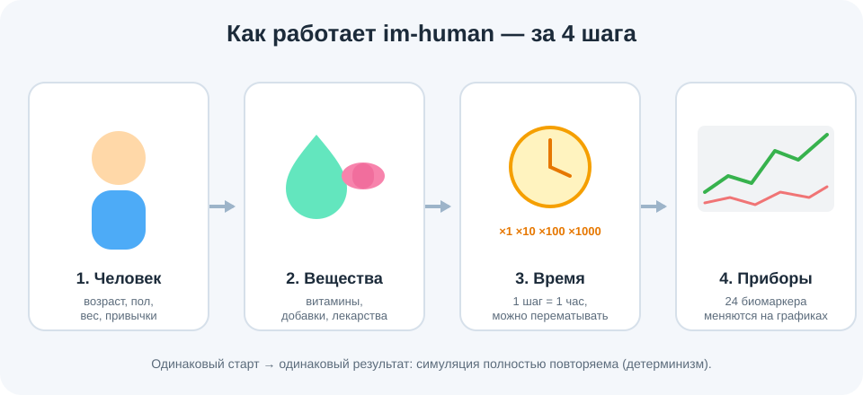
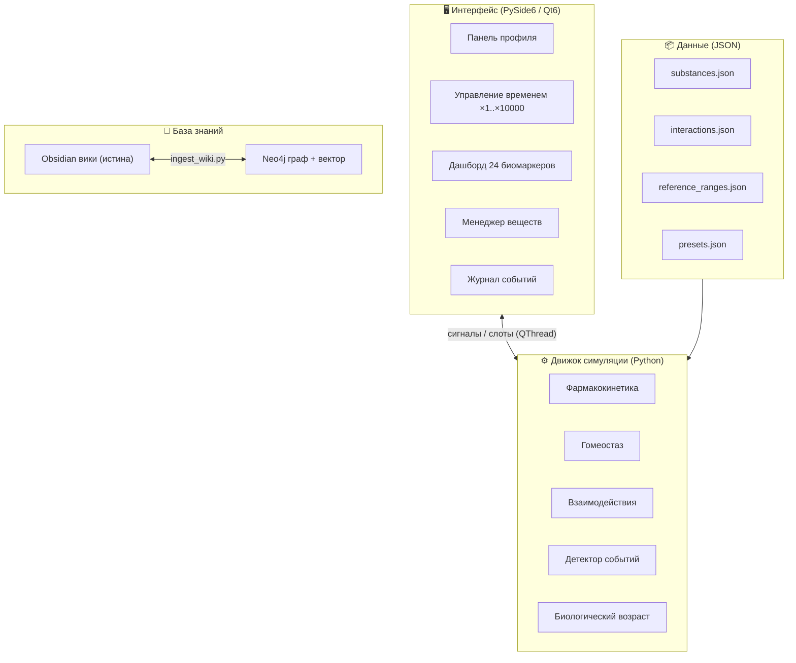
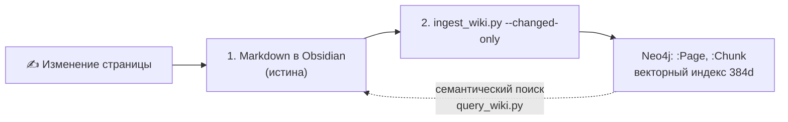
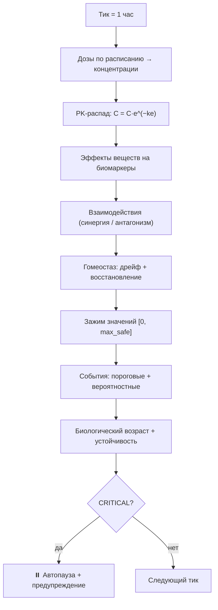

# im-human — Симулятор биологической модели человека

## License

This work is licensed under the Apache License, Version 2.0. See [LICENSE.txt](LICENSE.txt) for the full text.

Copyright © 2026 Vladimir Bazhin. Contact: info@simuostasis.com

> **Дисклеймер:** Это исследовательская симуляция, а не медицинский диагностический инструмент.
> Результаты не являются медицинской рекомендацией. Все числа отражают внутреннюю механику модели.
> Рапамицин и метформин — рецептурные препараты.

Воспроизводимая детерминированная симуляция воздействия веществ и интервенций на условную
биологическую модель человека. Инструмент исследовательский и образовательный.

---

## Содержание

- [Описание принципов работы (простыми словами)](#-описание-принципов-работы-простыми-словами)
- [Как это устроено (архитектура)](#как-это-устроено-архитектура)
- [Как работает симуляция (цикл тика)](#как-работает-симуляция-цикл-тика)
- [Установка](#установка)
- [Быстрый старт](#быстрый-старт)
- [Запуск тестов](#запуск-тестов)
- [Структура проекта](#структура-проекта)
- [Биомаркеры и вещества](#биомаркеры-mvp-24-наблюдаемых)
- [Neo4j — база знаний](#команды-neo4j)
- [Дисклеймер](#дисклеймер) · [License](#license)

---

## 🧒 Описание принципов работы (простыми словами)

*Этот раздел объясняет программу так, будто рассказываешь пятикласснику. Технические детали — ниже.*



Представь, что у тебя есть **виртуальный человечек** — почти как питомец в игре. Внутри у него
24 «прибора», которые показывают здоровье: сколько сахара в крови, какой пульс, сколько
холестерина и так далее.

Ты можешь делать четыре вещи:

1. **Выбрать человечка.** Молодого, среднего возраста или пожилого. У каждого свой возраст, вес,
   пол и привычки (сон, стресс, питание).
2. **Давать ему «капельки».** Это витамины, добавки и лекарства — например, омега-3, магний или
   метформин. Каждая капелька работает по-своему: одна чуть снижает холестерин, другая — сахар.
3. **Перематывать время.** В программе один «шаг» = один час жизни. Кнопки **×1, ×10, … ×10000** —
   это как перемотка в видео: можно смотреть по часам, а можно промотать **целый год за секунду**.
4. **Смотреть на приборы.** Графики рисуют линии, которые идут вверх или вниз, — так видно, что
   меняется в организме.

**А как программа всё это считает?** Каждый час она повторяет один и тот же порядок действий:

- смотрит, сколько «капелек» сейчас в крови (лекарство постепенно растворяется — как кубик сахара
  в чае);
- считает, как они двигают приборы;
- даёт организму немного «починить себя» — тело само тянет показатели обратно к норме (это
  называется **гомеостаз**);
- проверяет, не случилось ли что-то опасное. Если прибор зашкалил — программа **сама ставит
  паузу** и показывает предупреждение.

**Волшебное свойство:** если начать с того же человечка и тех же капелек, получится **ровно тот же
результат** — хоть тысячу раз запусти. Это как рецепт пирога: одинаковые продукты → одинаковый
пирог. Учёные называют это **детерминизмом**, и он нужен, чтобы опыты можно было проверять и
повторять.

И самое важное: **это игра-исследование, а не настоящий врач.** Числа показывают, как устроена
модель, а не дают советов о здоровье.

---

## Как это устроено (архитектура)

im-human состоит из четырёх слоёв: интерфейс, движок симуляции, данные и база знаний.



| Слой | Технология | Назначение |
|------|-----------|-----------|
| UI | PySide6 (Qt6) | Десктопный интерфейс (панели, графики, управление) |
| Движок | Python 3.11+ | Симуляция — фармакокинетика, гомеостаз, события |
| Валидация | Pydantic v2 | Типобезопасные модели данных (HumanProfile, SimulationState) |
| Вики | Obsidian (Markdown) | База знаний о биомаркерах, веществах, движке |
| Граф/Векторная база | Neo4j | Граф связей + семантический поиск (384d эмбеддинги) |
| Тесты | pytest | 12 тест-файлов, ~100 тестов |

### Хранение данных (DUAL-LAYER, ADR-002)

Все знания хранятся **одновременно в двух форматах**. При расхождении источников
**Obsidian является источником истины**.



Синхронизация вручную:
```powershell
cd W:\Obsidian\human\.neo4j
.\venv\Scripts\python.exe ingest_wiki.py --changed-only
```

---

## Как работает симуляция (цикл тика)

Сердце движка — **тик**: один шаг симуляции длиной 1 час. Каждый тик проходит строго
упорядоченный конвейер из 13 шагов (полное описание — в вики:
`06 - Engine/Simulation Engine.md`).



**Скорости.** Множитель = число тиков, которые движок считает за один «батч». Движок работает в
фоновом потоке (QThread) и считает тысячи тиков в секунду, а интерфейс перерисовывает графики
≈5 раз в секунду — поэтому окно не зависает даже на ×10000.

| Скорость | Тиков за батч | ≈ Время на 1 симулированный год |
|----------|---------------|--------------------------------|
| ×1 | 1 | ~2.4 часа |
| ×10 | 10 | ~14 минут |
| ×100 | 100 | ~1.5 минуты |
| ×1000 | 1000 | ~9 секунд |
| ×10000 | 10000 | < 1 секунды |

> Опорный факт производительности: бенчмарк рассчитывает 1 симулированный год (8760 тиков) менее
> чем за 5 секунд в оптимизированном режиме.

Подробные формулы каждого шага — в вики-разделе `06 - Engine/` (фармакокинетика, гомеостаз,
взаимодействия, детектор событий, биологический возраст, RNG).

---

## Установка

### Требования

- Python 3.11 или новее
- Neo4j 5.x / Neo4j Desktop (опционально — для работы с базой знаний)
- PySide6-совместимая графическая среда (для UI)

### Шаги установки

1. **Клонировать репозиторий:**

   ```powershell
   git clone <repo-url>
   cd human
   ```

2. **Создать виртуальное окружение:**

   ```powershell
   python -m venv venv
   ```

3. **Активировать окружение:**

   ```powershell
   # Windows (PowerShell)
   venv\Scripts\Activate.ps1

   # Windows (CMD)
   venv\Scripts\activate.bat
   ```

4. **Установить зависимости:**

   ```powershell
   pip install -r requirements.txt
   ```

5. **Настроить подключение к Neo4j** (опционально, для базы знаний):

   ```powershell
   copy .neo4j\.env.example .neo4j\.env
   # Открыть .neo4j\.env и указать реальные данные подключения:
   # NEO4J_URI=bolt://...
   # NEO4J_USER=...
   # NEO4J_PASSWORD=...
   # NEO4J_DATABASE=Human
   ```

---

## Быстрый старт

После установки:

```powershell
# 1. Активировать окружение (если не активировано)
venv\Scripts\Activate.ps1

# 2. Запустить приложение
python src/main.py
```

Приложение откроет главное окно с панелью профиля, управлением временем, дашбордом биомаркеров и
менеджером веществ. Рабочий процесс: **выбрать пресет профиля → добавить вещество (доза, интервал) →
выбрать скорость → «Запустить» → наблюдать динамику 24 биомаркеров.** Пошаговая инструкция —
в вики: `06 - Engine/User Guide.md` и `05 - Simulation/UI Guide.md`.

---

## Запуск тестов

### Полный тест-сьют (~100 тестов, 12 файлов)

```powershell
venv\Scripts\python.exe -m pytest src/tests/ -v
```

### Тест benchmark (1 симулированный год < 5 секунд)

```powershell
venv\Scripts\python.exe -O -m pytest src/tests/test_benchmark.py -v
```

### Headless-режим (без графического интерфейса, для CI/CD)

```powershell
$env:QT_QPA_PLATFORM = "offscreen"
venv\Scripts\python.exe -m pytest src/tests/ -v
```

### Тест-файлы

| Файл | Что тестирует |
|------|--------------|
| `test_data_layer.py` | Загрузка JSON-конфигов (биомаркеры, вещества, референсы) |
| `test_human_profile.py` | HumanProfile — пресеты, Pydantic-валидация |
| `test_substances.py` | IntakeSchedule, CycleConfig, dose-валидация |
| `test_pharmacokinetics.py` | PK-модель — абсорбция, элиминация, Cmax |
| `test_interactions.py` | Синергии и антагонизмы из interactions.json |
| `test_simulation.py` | SimulationEngine — тики, события, гомеостаз |
| `test_reproducibility.py` | Детерминизм — два прогона с seed=42 дают идентичный результат |
| `test_benchmark.py` | Производительность — 8760 тиков (1 год) за < 5 секунд |
| `test_kb_client.py` | KBClient — запросы к Neo4j базе знаний |
| `test_ui_integration.py` | UI-виджеты PySide6 в offscreen-режиме |
| `test_export_import.py` | Round-trip экспорт/импорт — 100+50 тиков идентичны 150 тикам |
| `test_phase08_docs.py` | Синхронизация документации (вики ↔ код/данные) |

---

## Структура проекта

```
src/
  domain/          # Модели данных (HumanProfile, SimulationState, Substance)
  engine/          # Движок симуляции (PK, гомеостаз, взаимодействия, экспорт)
  ui/              # PySide6 виджеты (главное окно, панели, дашборд)
  data/            # JSON-конфиги (вещества, биомаркеры, пресеты, референсы)
  tests/           # 12 pytest тест-файлов
.neo4j/            # Neo4j скрипты (ingest, query, schema, backup/restore)
Assets/            # Иллюстрации для документации
06 - Engine/       # Вики — документация алгоритмов движка (+ цикл тика)
07 - Analysis/     # Вики — аналитика и ограничения модели
```

### Команды Neo4j

```powershell
cd W:\Obsidian\human\.neo4j

# Проверить подключение
.\venv\Scripts\python.exe check_connection.py

# Инициализировать схему
.\venv\Scripts\python.exe setup_schema.py

# Загрузить вики (инкрементально)
.\venv\Scripts\python.exe ingest_wiki.py --changed-only

# Полная пересборка
.\venv\Scripts\python.exe ingest_wiki.py --clear

# Семантический поиск
.\venv\Scripts\python.exe query_wiki.py "HOMA-IR"
```

Резервное копирование и восстановление базы — см. вики `06 - Engine/Neo4j Backup Restore.md`.

---

## Биомаркеры MVP (24 наблюдаемых)

ЛПНП, ЛПВП, Триглицериды, ApoB, Глюкоза, Инсулин, HOMA-IR, HbA1c,
hs-CRP, IL-6, АЛТ, АСТ, ГГТ, Альбумин, Креатинин, eGFR, UACR,
Натрий, Калий, 25(OH)D, Гемоглобин, АД, Пульс, HRV.

Внутренние индексы: `oxidativeStressIndex`, `systemicInflammationIndex`,
`insulinSensitivityIndex`, `autophagyActivity`, `senescentCellBurden`, `biologicalAge`.

### Вещества (7) и взаимодействия (6)

Источник — `src/data/substances.json` и `src/data/interactions.json`.

| Вещество | Категория | EvidenceLevel |
|----------|-----------|---------------|
| Омега-3 | supplement | high |
| Витамин D3 | supplement | high |
| Магний | supplement | high |
| Берберин | supplement | moderate |
| Метформин ⚠️ | drug | high |
| Рапамицин ⚠️ | drug | moderate |
| NMN | supplement | low |

Взаимодействия: 2 синергии (Омега-3 × Витамин D3; Магний × Витамин D3), 2 антагонизма
(Метформин × Рапамицин; Берберин × Метформин), 2 записи самотоксичности (Рапамицин; Витамин D3).
Полная матрица — вики `04 - Interactions/Interactions Index.md`.

---

## Дисклеймер

Проект предназначен для исследовательских и образовательных целей.

> Это исследовательская симуляция, а не медицинский диагностический инструмент.
> Результаты не являются медицинской рекомендацией.
> Все числа отражают внутреннюю механику модели.
> Рапамицин и метформин — рецептурные препараты.
